```{r setup, include=FALSE}
options(htmltools.dir.version = FALSE)
```

```{r include=FALSE, eval=FALSE}
# Slides to PDF
library(webshot)
# install_phantomjs() # rendering engine
# download & install fonts from Xarigan::default_CSS
webshot("berlinR_GIS_talk.html", 
        "berlinR_GIS_talk.pdf",
        vwidth = 1920,
        vheight = 1080, 
        selector = ".remark-slide", # when xarigan
        zoom = 0.50)
```

class: inverse

.pull-left[

# Outline

.TOC[
1. State of <a href="#">#Rspatial</a>
1. Recap: GIS basics
1. Demo / Walkthrough
1. Readings
]

]

???
Goal: Pragmatism. Know enough to be able to produce.
Not a goal: Design Theory & Cartography

---
class: inverse

# About Me

+ Ilja | <a href="https://twitter.com/fubits">@fubits</a>
--

+ Dev & Data Person @ <a href="https://rankingdigitalrights.org/index2019/">New America / Ranking Digital Rights</a>
--

+ Freelance  4 Non-Profits (<a href="https://dadascience.design/portfolio/">dadascience.design/portfolio</a>)
--

  + Data Management
  + DataViz & InfoViz; Spatial / Maps `r emojifont::emoji("heart")`
  + Frontend / Backend, Research Software Engineering
  + ~~Design Thinking~~ Human-Centered Design ([ISO 9214](https://en.wikipedia.org/wiki/ISO_9241))
--

+ `r emojifont::emoji("mag")` Journey: Product Design / Strategy

???
Questionaire?
- Tidyverse?
- Geodata
- sf package

---
class: inverse

# Mid-2017

.bigpicture-two-thirds[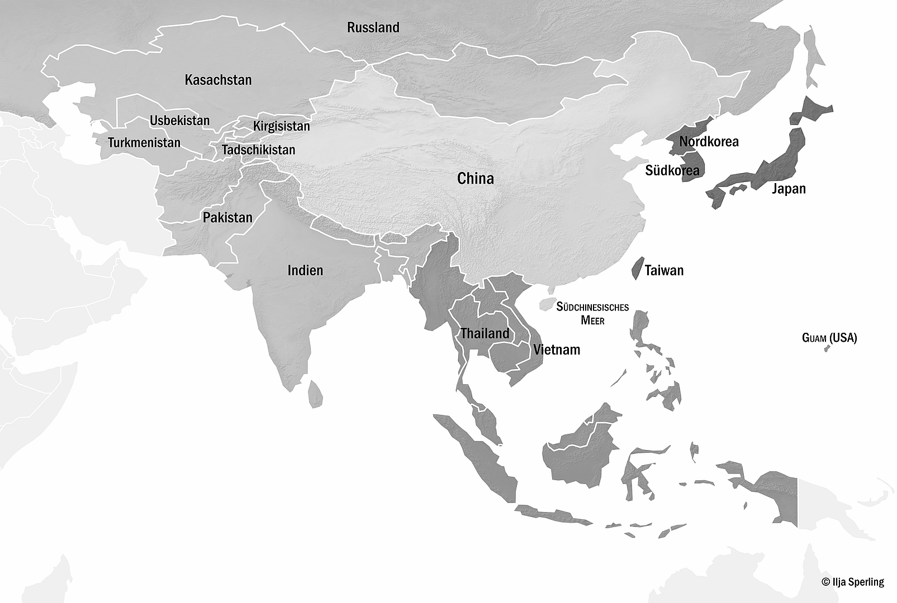]
--

.pull-left[
+ Base R
+ Spatial{X}DataFrame
+ plot()

[50% in dirty R...](https://dadascience.design/post/r-low-budget-high-res-mapping-with-r-for-not-for-profit-print/)

```r
asia_core <-  spRbind(
                spRbind(
                  spRbind(asia_china,
                  asia_east),
                     asia_seast),
                        asia_censouth)
asia_core@bbox[1] <- leftBorder
plot(asia_core)
```
]

---
class: inverse

## 2017/2018: sf - The Tidy Turn

.center[.flex[ <span style="font-size:5em; vertical-align: top">+</span> ]
]

.pull-center[
+ [github.com/r-spatial/](https://github.com/r-spatial/)
  + sf `r emojifont::emoji("package")` := (tidy) implementation of the [Simple Features open standard](https://en.wikipedia.org/wiki/Simple_Features)
  + mapview `r emojifont::emoji("package")` + mapedit `r emojifont::emoji("package")`
  + stars `r emojifont::emoji("package")`
  ]

---
class: inverse

# Early 2019

.bigpicture-two-thirds[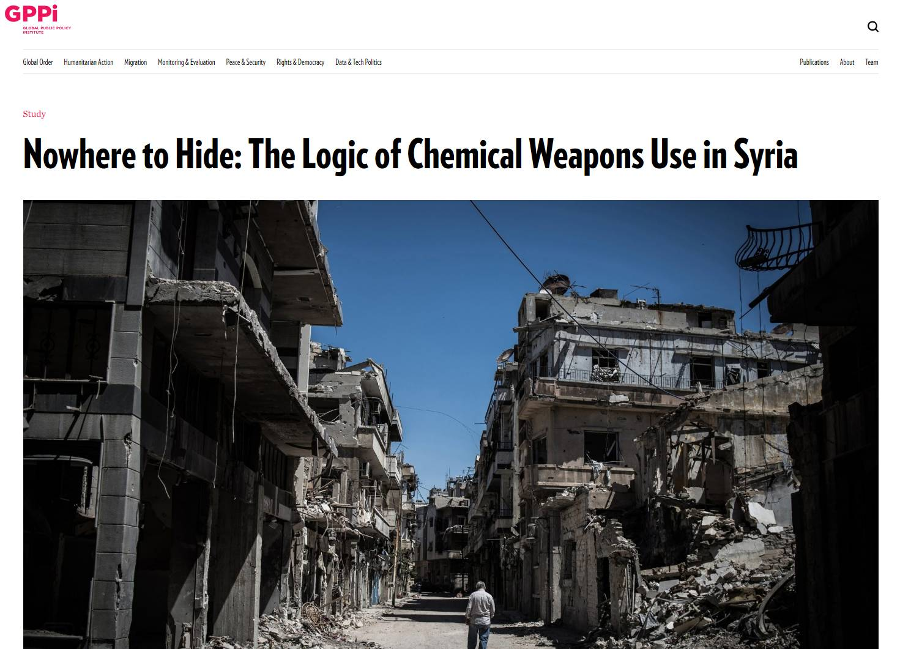]
--

.pull-left[
Report:<br/>
[Schneider/Lütkefend 2019](https://www.gppi.net/2019/02/17/the-logic-of-chemical-weapons-use-in-syria)
]

---
class: inverse

# Early 2019

.bigpicture-right[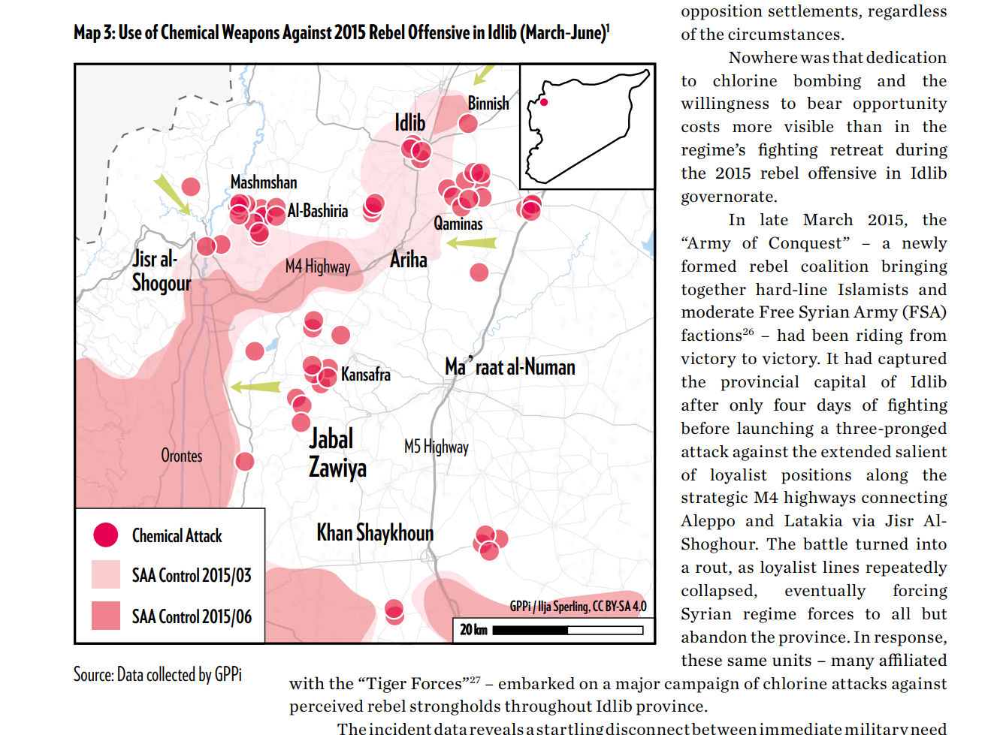]
--

.pull-left[80% in R...] 
---
class: inverse

# Mid-2019
.bigpicture-right[]
--

(Report on Security Forces in<br>Afghanistan; forthcoming)

95% R :=

.list-regular[
+ `r emojifont::emoji("package")` sf
+ `r emojifont::emoji("package")` geojsonsf
+ `r emojifont::emoji("package")` elevatr `r emojifont::emoji("pray")` --> SRTM
+ `r emojifont::emoji("package")` rayshader `r emojifont::emoji("fire")`
+ `r emojifont::emoji("package")` fuzzyjoin
+ open data
]

???
Why not QGIS?
---
class: inverse, center

.bigpicture-centre[]
???
Because: Automation

---
class: inverse, center, middle

.subtitle-slide[
# Status Quo in R
]


---
class: inverse

## #Rspatial

.bigpicture-right[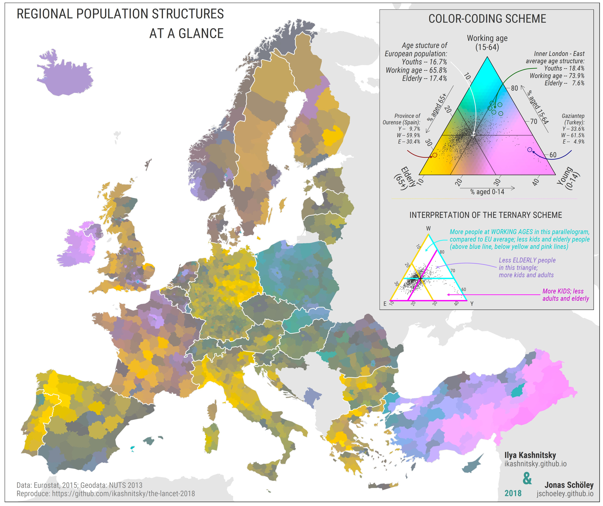]
.source[Repo:<br>[github.com/ikashnitsky](https://github.com/ikashnitsky/the-lancet-2018)]

---
class: inverse

## #30daymapchallenge 2019

--

.pull-left[.bigpicture[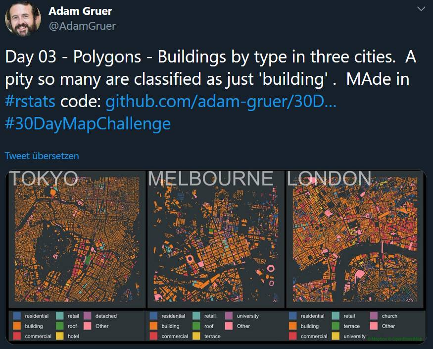]]
--
.bigpicture-right[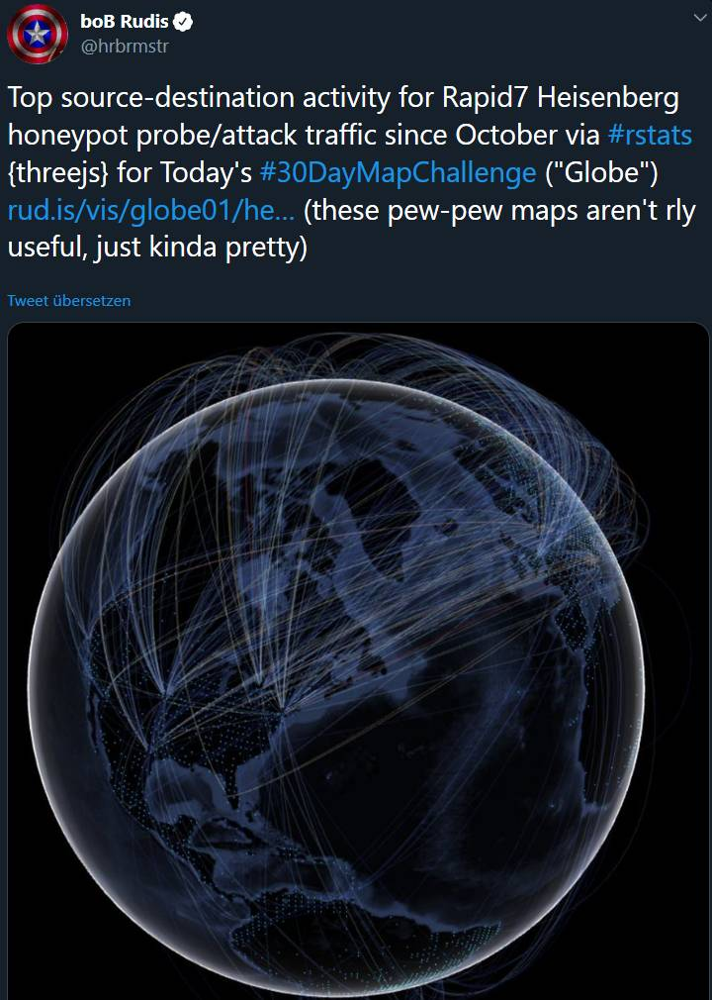]

---
class: inverse

## Rayshader + LiDAR (pt. 1)

.bigpicture-centre[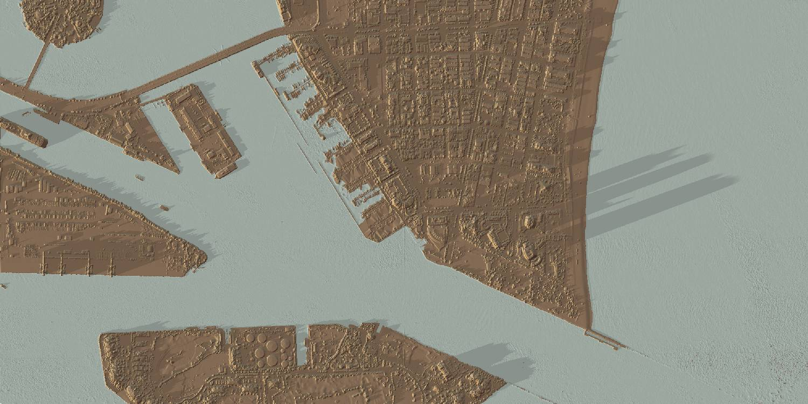]

.source[Sources: [tylermorganwall/rayshader `r emojifont::emoji("package")`
](https://github.com/tylermorganwall/rayshader); [MUSA Masterclass `r emojifont::emoji("fire")`](https://github.com/tylermorganwall/MusaMasterclass)]

---
class: inverse, center

.bigpicture-centre[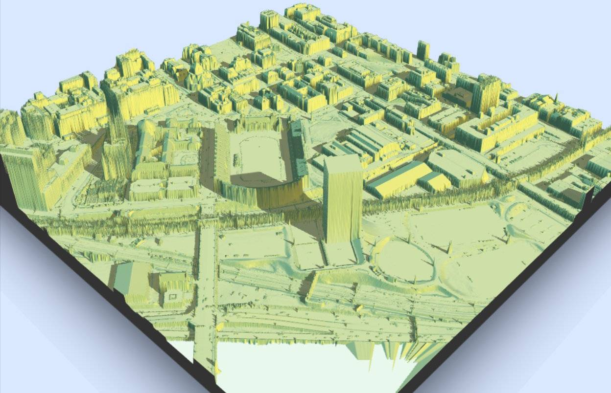]

---
class: inverse

## And mooooreee: WebGL / deck.gl / mapdeck / leafgl

.img-block[


]

.source[Sources: [SymbolixAU/mapdeck](https://symbolixau.github.io/mapdeck/articles/layers.html) `r emojifont::emoji("package")`; cf. [r-spatial/leafgl](https://github.com/r-spatial/leafgl)`r emojifont::emoji("package")`]

---
class: inverse

# #30daymapchallenge 2019

.center[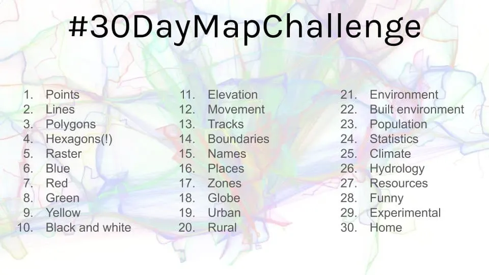]

.source[Source: [Topi @tjukanov](https://twitter.com/tjukanov/status/1187713840550744066)]


---
class: inverse
# Recap: GIS basics

--

.bigpicture-right[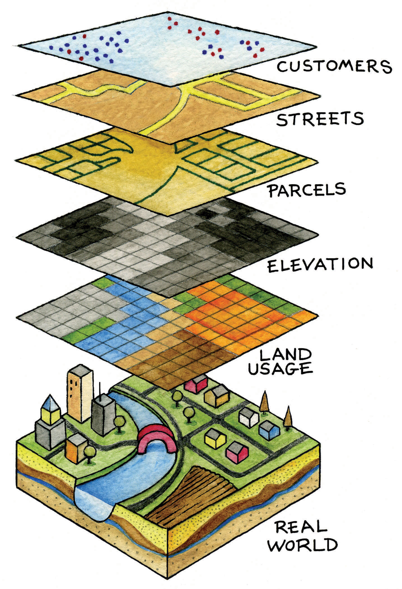]

.source[(Most probable image source: <a href="//commons.wikimedia.org/wiki/User:Gegensystem" title="User:Gegensystem">Andreas E. Neuhold</a>, <a href="https://creativecommons.org/licenses/by/3.0" title="Creative Commons Attribution 3.0">CC BY 3.0</a>, <a href="https://commons.wikimedia.org/w/index.php?curid=33542838">Link</a>)]

--

.pull-left[
+ {Point, Line, Polygon}, {Pixel}
+ Projection / CRS
+ Object Relations and Set Operations (~ SQL, but with paper & `r emojifont::emoji("scissors")`)
]

---
class: inverse
# Recap: Vectors

.bigpicture-right[]

+ points, sequences of points,<br>collections of <br>
sequenences of points ("multi")
+ everything (!) has a **square <br>bounding box** [BBOX]
+ slighly messy: polygons with<br> holes
+ `r emojifont::emoji("package")` sf

.source[Image source: [Data Carpentry](https://datacarpentry.org/organization-geospatial/02-intro-vector-data/), CC BY 4.0]

---
class: inverse

# Recap: Rasters

.bigpicture-right[
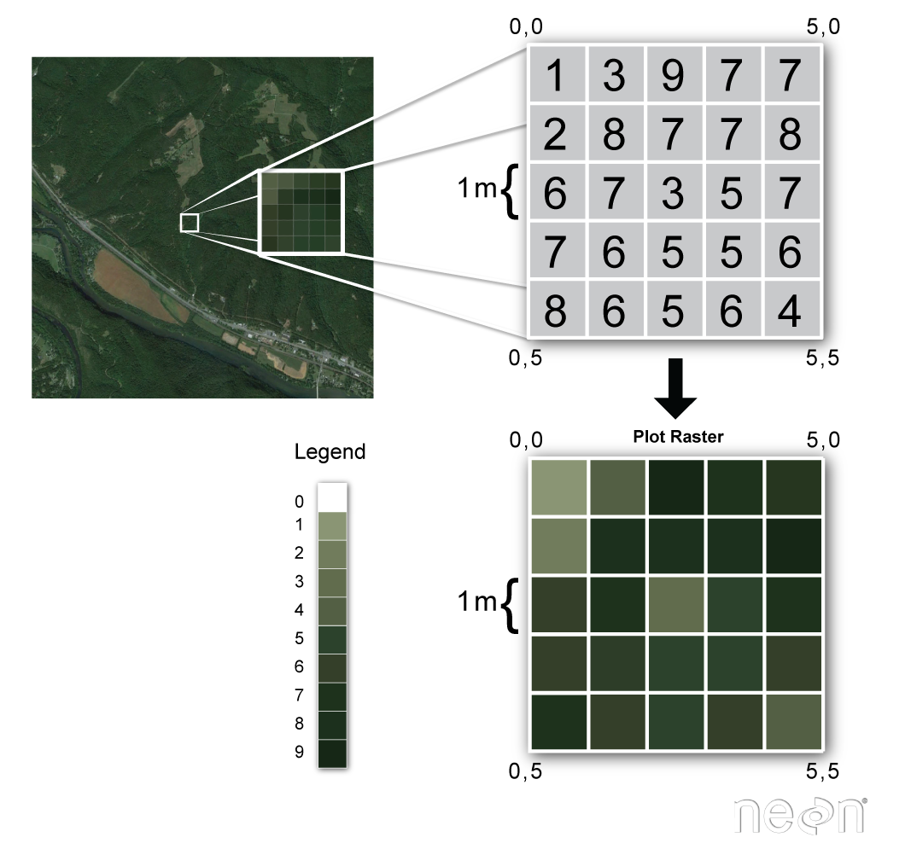
]

+ grid / matrix
+ can have layers
  + 1 layer = 1 variable<br>
  (height, sensor, R/G/B)
+ `r emojifont::emoji("package")` raster & `r emojifont::emoji("package")` stars
+ crop; mask; transform
+ GeoTiff
+ (`r emojifont::emoji("package")` [tidync: NetCDF](https://ropensci.org/blog/2019/11/05/tidync/))

.source[Image source: [Data Carpentry](https://datacarpentry.org/organization-geospatial/02-intro-vector-data/), CC BY 4.0]

---
class: inverse
# Recap: Spatial ∪ Relations

.bigpicture-two-thirds[]

.pull-left[
+ two-way relations:
  + a contains b
  + b contained by a<br>(b is within a)
+ challenge: 100% precision
+ mighy: [sf cheatsheet](https://github.com/rstudio/cheatsheets/raw/master/sf.pdf)
]

.source[Source: <a href="https://commons.wikimedia.org/wiki/File:TopologicSpatialRelarions2.png">Krauss</a>, <a href="https://creativecommons.org/licenses/by-sa/3.0">CC BY-SA 3.0</a>]

---

class: inverse, center, middle

.subtitle-slide[
# Walkthrough / Demo
]

---
class: inverse

# Case: Close the Gap

.pull-left-one-third[Our team won the [mobility challenge at the 2019 Climathon in Berlin](https://climathon.climate-kic.org/en/challenges/mobility/new-mobility) with this prototype.<br><br>
Techinical proof-of-concept: we classified every single bike lane segment in Berlin based on air quality, accident, and traffic probe data.<br>
<br>
Repo: [climathon-2019/R](https://github.com/leonardlorenz/climathon-2019/tree/master/R)
]

.bigpicture-two-thirds[]

---
class: inverse

# Readings

.bigpicture-right[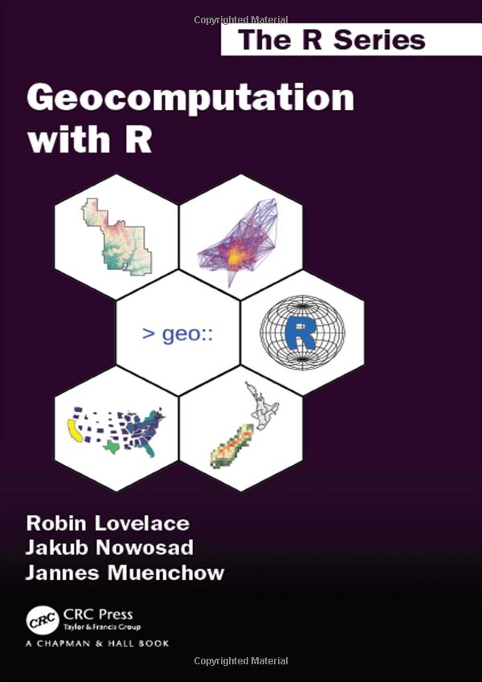]

+ [Lovelace / Nowosad / Muenchow (2019)](https://geocompr.robinlovelace.net/)
--

+ follow [Michael Sumner / @mdsumner](https://twitter.com/mdsumner)
  + Example: [R spatial in 2017](https://mdsumner.github.io/2017/01/10/spatial-r-2017.html)
--

+ [GIS like it's 2019 (me) ](https://dadascience.design/post/r-gis-like-it-s-2019-pragmatic-workflows-pt-1/)
 <- more resources, <br> readings, and recipes

---
class: inverse, center, middle

.key-text-red[
# Questions?
]

Slides: [dadascience.design/talks](https://dadascience.design/talks)

Reach out: [@fubits](https://twitter.com/fubits)

___

[CC BY-SA 4.0](https://creativecommons.org/licenses/by-sa/4.0/) (my stuff only, of course)

Slides created with [**xaringan**](https://github.com/yihui/xaringan).
