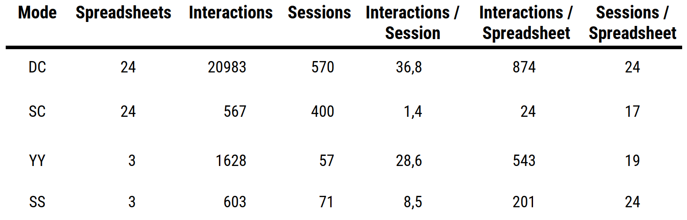

class: inverse
background-image: url('img/2020-pipeline.png')
background-position: center
background-size: contain

# Sneak<br>Preview


---
# Outline

.pull-left[

.TOC[
1. What/Why: The ~~Problem~~ Challenge
1. How:
  1. Google App Script
  1. Spreadsheet Factory
1. Demo
1. Lessons Learned

]

]

---
# About Me

+ Ilja | <a href="https://twitter.com/fubits">@fubits</a>
--

+ Tech Lead @ <a href="https://rankingdigitalrights.org/">Ranking Digital Rights</a> (New America)
--

+ Freelance Product Developer (<a href="https://dadascience.design/portfolio/">dadascience.design/portfolio</a>)
--

  + Web & Software Engineering
  + DataViz & InfoViz; Spatial / Maps `r emojifont::emoji("heart")`
  + Data Management & Information Security
  + ~~Design Thinking~~ Human-Centered Design ([ISO 9214](https://en.wikipedia.org/wiki/ISO_9241))
--

+ (BA/MA = [CommSci, PolSci / Computational Social Science])

---
background-image: url('img/gppi-chemical-weapons.png')
background-size: cover
.source[[chemicalweapons.gppi.net](https://chemicalweapons.gppi.net/)]

---
class: center, middle, subtitle-slide

# WHAT

---
# Use Case: [Ranking Digital Rights Index](https://rankingdigitalrights.org/index2019/)

--

- Evaluates policies of Internet and Telecommunication companies
  - Apple, Alibaba, Facebook, Google, Microsoft, Telefonica,...
  - 2020: 5th Index; 26 companies / 77 services
--

- Methodology
  - 2019: 35 Indicators / 184 Elements
  - 2020: 58 Indicators / 335 Elements
--

  - 7 Main Research Steps / 21 Substeps
  - Company Feedback (I/O)
--

  - 30+ Researchers
  - ~9 months per cycle
  
---

## Single Indicator Example

+ results
+ comments
+ sources
+ scores
  + element
  + level
  + indicator

.bigpicture-two-thirds[

]

---

## Research Process


---
## Legacy Spreadsheet Infrastructure


---

background-image: url('img/excel-meme.jpg')
background-size:contain

---
## 2019 Interactions


---
## 2019 Interactions



---
class: center, middle, subtitle-slide

# WHY

---

## Goal: Production

> `O(x) > (26 * (58 + n)) * x`  
> `O(x) > (26 * (335 * n)) * x`

--

```{javascript}
Companies.forEach(Company => {
        produceInputSpreadsheet(ResearchSteps, Indicators, Company)
    })
```

--

```{javascript}
Companies.forEach(Company => {
        produceOutputSpreadsheet(ResearchSteps, Indicators, Company)
    })

Companies.forEach(Company => {
        produceFeedbackSpreadsheet(ResearchSteps, Indicators, Company)
    })

produceSummaryScoresSpreadsheet(ResearchSteps, Indicators, Company)

produceearOnYearSpreadsheet(ResearchSteps, Indicators, Company)
```

---

## Goal - Data Scientist

> Public Final Dataset = `275.000` data points

--

```r
## Import Tidy Data

library(tidyverse)
# data <- read_csv("2020-tidy-data.csv")
data <- DBI::dbReadTable(sql_con, "2020-tidy-data")

## Analyze

data %>% 
  select() %>% 
  filter() %>% 
  group_by() %>% 
  summarize() %>% 
  ggplot()
  
```

---

## Goal - Research Team

+ Strategic Goal: help Index scale
  + Automate the redundant / labour-intense / error-prone parts
  + Increase data accessibility (internally and externally)
  + Increase robustness & maintainability
  + Increase researcher autonomy


+ Challenges:
  + Index Dimensions + Year-on-Year Compatibility
  + vs SpReAdShEeTs
  + vs [Usability](https://www.interaction-design.org/literature/topics/usability) (Efficiency + Effectiveness + Satisfaction)

---
class: center, middle, subtitle-slide

# HOW

---

## Process: Capacity Assessment -> Data Management Roadmap


---

## Process: Product Vision


---

## Module Development: UI/UX

---
background-image:url('img/sheet-ui-plain.png')
background-size: contain

---
background-image:url('img/sheet-ui-labelled.png')
background-size: contain

---
## Catch 22: Structured Data Layer

---
background-image: url('img/named-ranges.png')
background-size: contain

---
class: center, middle, subtitle-slide

# Google Apps Script

---
## Google Apps Script

[https://developers.google.com/apps-script](https://developers.google.com/apps-script)
--

+ API for Google Sheets / Drive / Slides / Docs / Gmail / et al.
--

+ Google Apps Script :=
  + Javascript with Google Classes/Methods
  + Development Environment
--

+ (Google API v4 := RESTful)
--

+ `clasp` [Node Package](https://github.com/google/clasp) := CLI for Apps Scrip (--> VSCode)

---

## Google Apps Script - [Spreadsheets API](https://developers.google.com/apps-script/reference/spreadsheet/sheet)

--
```javascript
const SS = SpreadsheetApp.openById(fileId) // get Spreadsheet
let Sheet = SS.openBySheetName("results") // get Sheet ("Tab")
```
--
```javascript
Sheet.appendRow(["col A", "col B", "col C"]) // add a row with prefilled cells
```--

```javascript
// add multiple rows (2D array)
rows = [
["row 1", "row 1 value"],
["row 2", "row 2 value"]
["row 3", "row 3 value"]
]

rows.push([["row 4", "row 4 value"]])

rows.forEach(row => Sheet.appendRow(row))
```

---
background-image: url('img/dev_environment.jpg')
background-size: fit

## Google Apps Script - [clasp](https://github.com/google/clasp)

---
class: center, middle, subtitle-slide

# DEMO

---

# The Fruits of our Labour

+ ETL Pipeline
+ CRON
+ QA/QC

.bigpicture-two-thirds[

]

---

# The Fruits of our Labour


---
background-image: url('img/metabase.png')
background-size: contain

# Metabase

---
background-image: url('img/metabase-export.png')
background-size: contain

# Metabase
---
# Lessons Learned

.pull-left[
+ 2020 Index --> upper boundries of GAS & Sheets
+ Google Sheets Limitations
  + 5.000.000 cells / file limit
  + Caching
  + crappy event listener
+ Google Script Limitations
  + single threaded (no async / await)
  + API rate limits**
+ Frontend-heavy
]
--

.pull-right[
+ Data Store Approach +1/-1
+ UX
+ Integration with other Services / APIs (`urlFetch()`)
+ Spreadsheet-Bound Scripts --> Menu / `Sheet.onEdit()`
+ aUtOmAtIoN^3
+ robustness +1/-1 (i.e. named ranges "fidelity")
]

---
class: center, middle

# Questions?

Slides: [dadascience.design/talks](https://dadascience.design/talks)

Reach out: [@fubits](https://twitter.com/fubits)

___

Slides created with [xaringan](https://github.com/yihui/xaringan).
